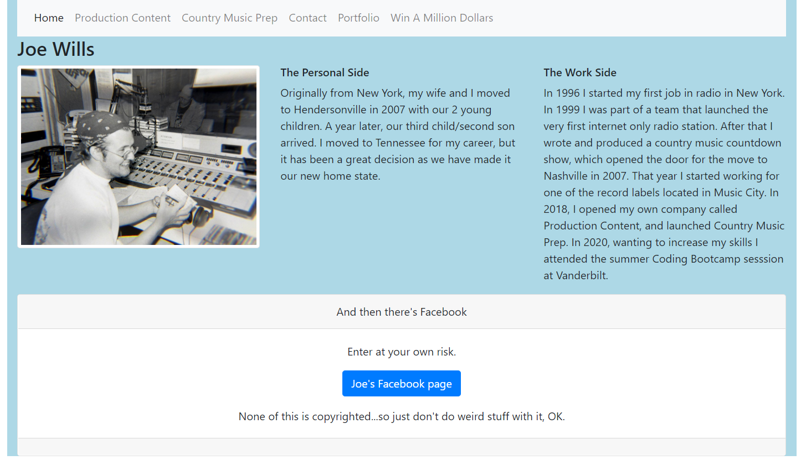

My Portfolio...
it may be small, but I'm buidling on it...

This includes a bio site, with links to my country music sites, 
my portfolio, and contact page.

https://joewills615.github.io/Portfolio/

When you arrive at the site you'll hit my intro page...

After reading it and being impressed...and ignoring the fact that the 
picture is from 25 years ago, when I was in college, you might head to 
the nav bar, and check out Production Content...

It's going through a little rebranding right now, but still, 
it's good to have on there, cause when it's done...it'll
be impressive. Next to the Production Content link you'll
find the Country Music Prep tab...

CMP is also in flux...damn COVID...

But, say you want to contact me, there's the contact tab...

A limited but growing Projects page is here under "Portfolio"...

and finally if you get the joke, you laugh...if you 
don't get the jump, you just enjoy an insanely catchy 
pop tune from the 80s. And no, there's no million dollars to win...

